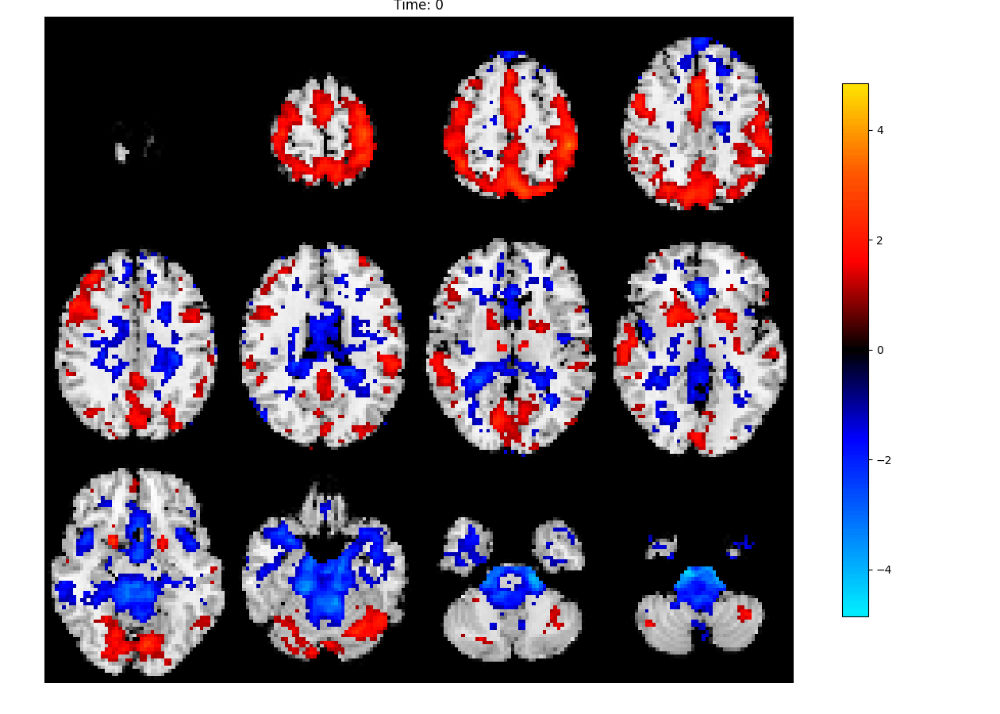
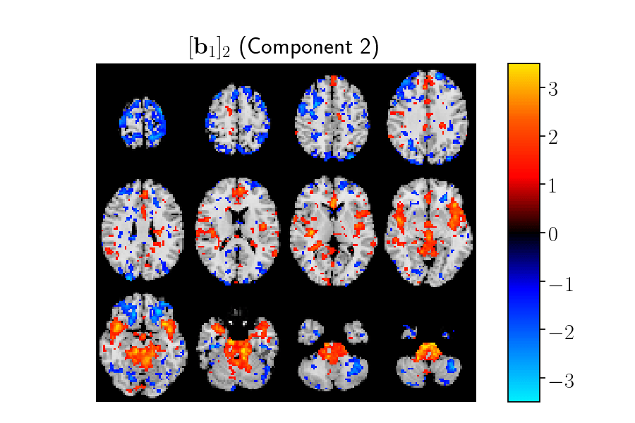

# Supplementary materials
__Tracing Network Evolution Using the PARAFAC2 Model__

## Table of contents
 1. Simulated data
 2. Component videos
 3. Code used in this paper

## Simulated data

### Generation of simulated data

We generated two types of simulated data sets: (i) data sets
following (2) as well as the Parafac2 constraint, and (ii) data sets
following (2), having time-evolving patterns _**B**ₖ_ that do not
necessarily follow the Parafac2 constraints.

__First mode:__ Suppose that the first mode of the tensor
represents subjects. In this mode, we introduce a clustering structure
since our goal with the analysis of time-evolving data is often to
identify patterns that can separate different groups of subjects. The
factor vectors, i.e., columns of _**A**_, in this mode can be regarded
as a measure of how much each underlying pattern (network) contributes
to the signal of each subject. In order to generate the clustering
structure, two vectors, representing the mean of each group, _**m**₁_
and _**m**₂_ were drawn randomly from _\{0, 1\}ᴿ_. Then, for each
subject, _i_, a group, _gᵢ ∈ \{1, 2\}_, was chosen at random and a
row vector _**a**ᵢ ∈ ℝ¹ˣᴿ_ was drawn from a normal
distribution with _μ = **m**₁_ (mean) if _gᵢ = 1_ and _μ = **m**₂_
and _σ=0.5_ (standard deviation). These row vectors were stacked 
to generate an _I×R_ matrix _**A**_.

__Second mode (dynamic networks):__ _**B**_ matrices, i.e.,
_[**B**ₖ]_, are simulated with column vectors representing temporally
evolving networks, where each element, _[bₖ]ⱼᵣ_, can be
considered as a node while each factor vector _[**b**ₖ]ᵣ_
corresponds to a network. If node _j_ is present in network _r_ at time
step _k_, then _[bₖ]ⱼᵣ_ is high, i.e., node _j_ is an active
node; otherwise, _[bₖ]ⱼᵣ_ is low, and node _j_ is a passive
node.

First, networks are initialized by dividing _J_ nodes into _R_ networks
randomly. Once initialized, networks may evolve in three different ways
at each time step: (i) Growing: With _pᵢ_ probability, a random passive
node becomes active. (ii) Shrinking: With _pₘ_ probability, a random
active node becomes deactivated. Deactivated nodes are not re-added to
the network. (iii) Shifting: With probability _pₛ_, node indices
increase by _1_. We also generate a baseline matrix, _[**B̃**ₖ]_
with entries _[b̃ₖ]ⱼᵣ_ randomly drawn from a normal
distribution with _μ=0.2_ and _σ=0.1_. Finally, in order to
generate _[**B**ₖ]_, we iterate through all nodes in network _r_, and
if node _j_ is active in network _r_ at time _k_, then
_[bₖ]ⱼᵣ = [b̃ₖ]ⱼᵣ +  [ρₖ]ⱼᵣ_, where
_[ρₖ]ⱼᵣ_ is drawn from a normal distribution
(_μ=0.8_ and _σ=0.1_). Otherwise,
_[bₖ]ⱼᵣ = [b̃ₖ]ⱼᵣ_. These steps are repeated for a
simulation that lasts for _K_ time steps, forming _[**B**ₖ]_, for
_k=1, 2,..., K_.

The evolving network set-up contains a network generated using
_pₘ = pᵢ = 0_ and _pₛ=1_ (shifting), two networks using _pᵢ > pₘ_ ,
one of which with _pₛ=0.5_ (growing & shifting) and the other with
_pₛ=0_ (growing), and one network with _pᵢ < pₘ_ and _pₛ=0_
(shrinking) (See Figure 2 in the paper). We also generated random _**B**ₖ_-s that
follow the Parafac2 constraints. Note that evolving networks do not
often satisfy this constraint.

__Third mode (time):__ Factor vectors in this mode are simulated
using two different set-ups: (i) all factor vectors drawn from a uniform
distribution, _𝓤(1.1, 2.1)_ (ii) one factor vector follows a uniform distribution, _𝓤(1.1, 2.1)_, and
the remaining three follow an exponential function, a sigmoidal function
and a sine wave (See Figure 1 in the paper).

## PARAFAC2 components
These high-quality gifs were generated using the OpenSource tool [gifski](https://gif.ski/)

## Code used
Three toolboxes were used during this project, [TensorKit](https://github.com/marieroald/tensorkit), a Python library for tensor decompositions. [TensorKit Tools](https://github.com/marieroald/tensorkit_tools), an (undocumented) library to run large scale tests with TensorKit and [SynTen](https://github.com/marieroald/synten), a the simulation library developed this paper. Additionally, the code used to generate the figures is available [here](https://github.com/marieroald/plottools).
