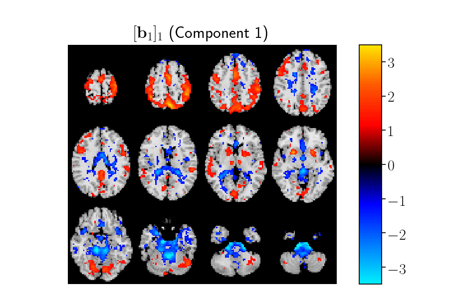

Supplementary materials
=======================

**Tracing network evolution using the parafac2 model**

.. contents:: Table of Contents

Simulated data
--------------

We generated two types of simulated data sets: (i) data sets following
(2) as well as the Parafac2 constraint, and (ii) data sets following
(2), having time-evolving patterns ***B**\ ₖ* that do not necessarily
follow the Parafac2 constraints.

**First mode:** Suppose that the first mode of the tensor represents
subjects. In this mode, we introduce a clustering structure since our
goal with the analysis of time-evolving data is often to identify
patterns that can separate different groups of subjects. The factor
vectors, i.e., columns of **A**, in this mode can be regarded as a
measure of how much each underlying pattern (network) contributes to the
signal of each subject. In order to generate the clustering structure,
two vectors, representing the mean of each group, ***m**\ ₁* and
* **m**\ ₂ * were drawn randomly from *{0, 1}ᴿ*. Then, for each subject,
*i*, a group, *gᵢ ∈ {1, 2}*, was chosen at random and a row vector
***a**\ ᵢ ∈ ℝ¹ˣᴿ* was drawn from a normal distribution with *μ =
**m**\ ₁* (mean) if *gᵢ = 1* and *μ = **m**\ ₂* and *σ=0.5* (standard
deviation). These row vectors were stacked to generate an *I×R* matrix
***A***.

**Second mode (dynamic networks):** ***B*** matrices, i.e.,
*[**B**\ ₖ]*, are simulated with column vectors representing temporally
evolving networks, where each element, *[bₖ]ⱼᵣ*, can be considered as a
node while each factor vector *[**b**\ ₖ]ᵣ* corresponds to a network. If
node *j* is present in network *r* at time step *k*, then *[bₖ]ⱼᵣ* is
high, i.e., node *j* is an active node; otherwise, *[bₖ]ⱼᵣ* is low, and
node *j* is a passive node.

First, networks are initialized by dividing *J* nodes into *R* networks
randomly. Once initialized, networks may evolve in three different ways
at each time step: (i) Growing: With *pᵢ* probability, a random passive
node becomes active. (ii) Shrinking: With *pₘ* probability, a random
active node becomes deactivated. Deactivated nodes are not re-added to
the network. (iii) Shifting: With probability *pₛ*, node indices
increase by *1*. We also generate a baseline matrix, *[**B̃**\ ₖ]* with
entries *[b̃ₖ]ⱼᵣ* randomly drawn from a normal distribution with *μ=0.2*
and *σ=0.1*. Finally, in order to generate *[**B**\ ₖ]*, we iterate
through all nodes in network *r*, and if node *j* is active in network
*r* at time *k*, then *[bₖ]ⱼᵣ = [b̃ₖ]ⱼᵣ + [ρₖ]ⱼᵣ*, where *[ρₖ]ⱼᵣ* is
drawn from a normal distribution (*μ=0.8* and *σ=0.1*). Otherwise,
*[bₖ]ⱼᵣ = [b̃ₖ]ⱼᵣ*. These steps are repeated for a simulation that lasts
for *K* time steps, forming *[**B**\ ₖ]*, for *k=1, 2,..., K*.

The evolving network set-up contains a network generated using *pₘ = pᵢ
= 0* and *pₛ=1* (shifting), two networks using *pᵢ > pₘ* , one of which
with *pₛ=0.5* (growing & shifting) and the other with *pₛ=0* (growing),
and one network with *pᵢ < pₘ* and *pₛ=0* (shrinking) (See Figure 2 in
the paper). We also generated random ***B**\ ₖ*-s that follow the
Parafac2 constraints. Note that evolving networks do not often satisfy
this constraint.

| **Third mode (time):** Factor vectors in this mode are simulated using
  two different set-ups: (i) all factor vectors drawn from a uniform
  distribution, *𝓤(1.1, 2.1)* (ii) one factor vector follows a uniform
  distribution, *𝓤(1.1, 2.1)*, and the remaining three follow an
  exponential function, a sigmoidal function and a sine wave (See Figure
  1 in the paper).

PARAFAC2 components
-------------------

These high-quality gifs were generated using the OpenSource tool
`gifski <https://gif.ski/>`__ |Component 1| |Component 2|

Code used
---------

Three toolboxes were used during this project,
`TensorKit <https://github.com/marieroald/tensorkit>`__, a Python
library for tensor decompositions. `TensorKit
Tools <https://github.com/marieroald/tensorkit_tools>`__, an
(undocumented) library to run large scale tests with TensorKit and
`SynTen <https://github.com/marieroald/synten>`__, a the simulation
library developed this paper. Additionally, the code used to generate
the figures is available
`here <https://github.com/marieroald/plottools>`__.

.. |Component 2| image:: component_2.gif
